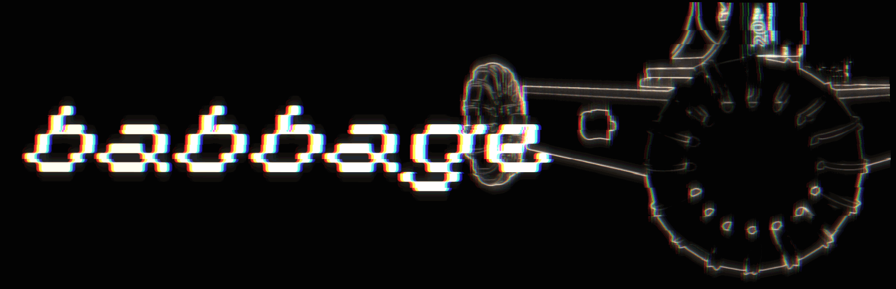

# babbage

### a cheap, open-source, 3d-printable mobile manipulator.



<p align="center">
  <sub>made with grainrad!</sub>
</p>

babbage is a small mobile robot with a holonomic drivetrain, a 4-dof arm, a gripper, a webcam, and a raspberry pi.

the idea is pretty simple: **make a robot that you can actually build.**

it's still a work in progress, but the current prototype can drive around, detect apriltags, drive toward them, and use its arm and gripper to pick up an apriltag cube.

## what is it?

babbage is basically a platform for messing around with robotics without needing a robotics lab.

the base is a 4-wheel holonomic x-drive with omniwheels, with a 4-dof arm mounted on top. a raspberry pi handles the higher-level software and a usb webcam gives it vision.

the hardware is intentionally pretty basic:

* raspberry pi 5 1gb (pi 4 or newer should work too)
* 4 × ga25-370 dc gearmotors
* 4 × omniwheels
* tb6612fng motor driver
* pca9685 servo controller
* 2 × mg996r servos
* 1 × ds3218 30kg/cm servo
* 1 × mg90 servo
* 3d-printed gripper
* usb webcam
* 12v power
* a lot of 3d printed plastic

the ga25-370s actually have quadrature encoders, but babbage doesn't use them yet. the drivetrain is currently open-loop.

that's partly because i want the hardware to stay simple, but it's also useful for the eventual **babbage-vla** project, where the goal is to have a relatively cheap model running on something like an m1 mac mini control the robot.

## what can it do?

right now:

* drive around
* move in any direction with the holonomic drivetrain
* detect apriltags
* drive toward apriltags
* teleoperate the arm
* control the gripper
* pick up an apriltag cube
* run the whole thing from a raspberry pi

there's still a lot missing:

* proper localization
* encoder-based odometry
* autonomous grasping
* better motion planning
* autonomous task execution
* and eventually some kind of actual intelligence

## the bigger idea

the point of babbage isn't really to make one finished robot.

i want it to be a cheap physical platform for messing around with computer vision, robotics, imitation learning, reinforcement learning, and embodied ai.

ideally, you could eventually give it something like:

> "go find the red cube and put it on the table."

and have a model figure out how to use the robot's functions to actually do it.

that's where babbage-vla comes in.

if i end up building more of these, i'd also like to try having multiple babbages work together. but that's getting a bit ahead of where the project is right now.

## building one

the mechanical parts are designed in fusion and are meant to be printable on a normal consumer 3d printer.

i've been printing the current parts in pla on an ender 3 v3 se. petg should probably work too, although i haven't tested it nearly as much.

the plan is to release both the editable fusion files and simpler stls, so you don't need to know cad to build one.

the repo will include:

* fusion source files
* stls
* wiring diagrams
* firmware
* python software
* assembly documentation
* parts lists

the exact bill of materials is still being worked out, but i'm aiming for roughly **$250 cad** for a complete build. obviously that depends on where you buy everything and how much you already have lying around.

## software

babbage runs python on the raspberry pi.

i'm trying to keep the software fairly straightforward instead of building some enormous robotics stack around it. the pi handles the higher-level stuff, while the motor and servo controllers deal with the hardware.

```text
                 ┌───────────────┐
                 │  raspberry pi │
                 │               │
                 │    python     │
                 └───────┬───────┘
                         │
              ┌──────────┴──────────┐
              │                     │
       ┌──────▼──────┐       ┌──────▼──────┐
       │  tb6612fng  │       │   pca9685   │
       │             │       │             │
       └──────┬──────┘       └──────┬──────┘
              │                     │
        4 × ga25-370          4-dof arm + gripper
```

## roadmap

### mechanical

* [x] holonomic drivetrain
* [x] 4-dof arm
* [x] gripper
* [ ] improve arm design
* [ ] improve drivetrain
* [ ] finalize printable parts

### electronics

* [x] raspberry pi control
* [x] tb6612fng motor control
* [x] pca9685 servo control
* [x] 12v power system
* [ ] encoder support
* [ ] better power distribution
* [ ] maybe a custom pcb eventually

### software

* [x] basic driving
* [x] teleoperation
* [x] webcam support
* [x] apriltag detection
* [x] apriltag navigation
* [x] arm control
* [x] gripper control
* [x] basic object pickup
* [ ] autonomous grasping
* [ ] localization
* [ ] motion planning
* [ ] autonomous task execution

### ai

* [ ] llm-controlled robot functions
* [ ] autonomous task planning
* [ ] babbage-vla
* [ ] multi-babbage cooperation

## why "babbage"?

because charles babbage built machines that were wildly ahead of what was practical at the time.

also, "babbage" sounded better than LoCAR.

## contributing

babbage is open source, and i'd like other people to mess with it.

if you build one, redesign something, make a better gripper, add a sensor, improve the software, or do something weird with it that i didn't think of, i'd love to see it.

it's intentionally still a little rough. i'd rather have people actually build it and break it than spend another six months trying to make the repo look finished.

---

**babbage is a robot you can build, modify, break, and teach things to.**

go crazy.
